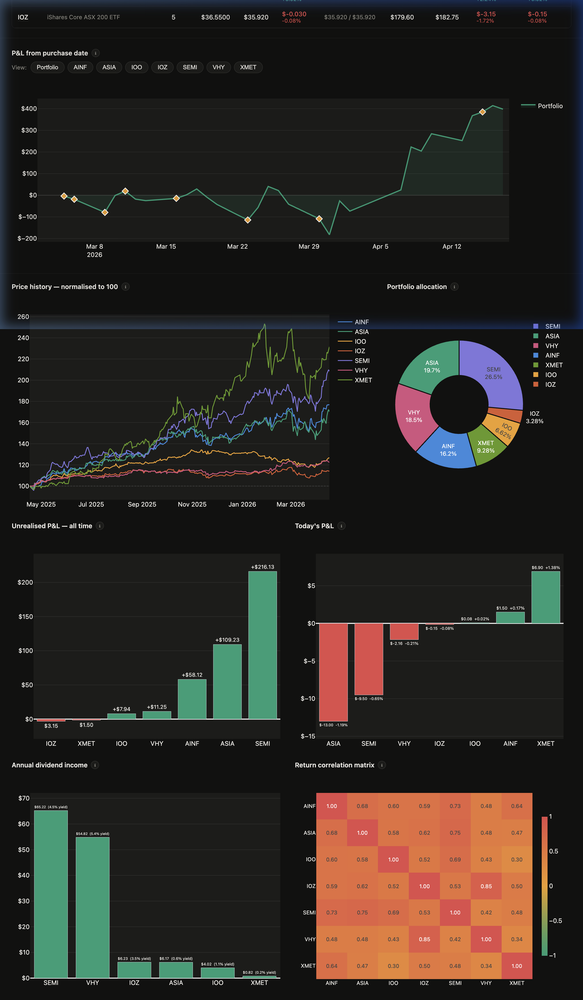

# Portfolio Dashboard — Live P&L

A local web dashboard for tracking an ASX ETF portfolio with live prices,
P&L history, dividends, and correlation analysis.

Built with Dash, Plotly, and yfinance.



## Features
- **Live Tracking**: Real-time prices via Yahoo Finance (yfinance) with ASX-specific bulk optimizations.
- **Intraday Monitoring**: Dedicated "Today" P&L tracking with high-frequency session caching and persistent daily snapshots.
- **Positions Deep-Dive**: Granular view of each holding with interactive candlestick charts, transaction history, live sparklines, and integrated **Dividend Analysis**.
- **Intelligence Dashboard**: Institutional-grade risk metrics including **Sharpe Ratio**, **Annualized Volatility**, and **Max Drawdown**.
- **Portfolio Forecasting**: Forward-looking return projections powered by **Facebook Prophet** with Australian holiday awareness and continuity correction.
- **Allocation Analysis**: Hierarchical Sector and Geographic allocation with Sunburst drill-downs and smart risk alerts.
- **Dividend Tracking**: Unified dividend engine calculating **Realized Income** (tranche-level accuracy) vs. projected annual distributions, now integrated directly into the ticker deep-dive panel.
- **Interactive UI**: Modern, responsive interface with buy/sell entry, calendar-based tracking, and global state persistence.
- **Research Assistant**: AI-powered chat interface with **Gemini 2.5 Flash Lite** for deep portfolio analysis, ticker research, and persistent conversation memory.
- **Trading Signal Engine**: Deterministic, rule-based BUY/SELL/HOLD signals for both **portfolio holdings** and **watchlist tickers** using a weighted scoring model (Trend, Momentum, Price vs 200MA, Cost basis, Drawdown). An AI Analyst overlay explains each signal without overriding it. Available on the Portfolio, Positions, and Watchlist pages — triggered manually, never auto-runs.
- **Modular Architecture**: Strictly decoupled layer model (Presentation, Service, Engine, Data) with a **PortfolioRepository** abstraction and a pre-seeded store pattern.
- **Premium Aesthetics**: "Aura Ledger" dark-themed design with glassmorphism, Radix UI overrides, and smooth transitions.

## Setup

**Requirements:** Python 3.11+

```bash
# 1. Clone the repo
git clone https://github.com/YOUR_USERNAME/portfolio_dashboard.git
cd portfolio_dashboard

# 2. Create and activate a virtual environment
python -m venv portfolio-env
source portfolio-env/bin/activate      # Mac/Linux
portfolio-env\Scripts\activate         # Windows

# 3. Install dependencies
pip install -r requirements.txt

# 4. Add your transactions to the CSV
# Edit stock_portfolio_transactions.csv — see format below

# 5. Run
python app.py
# Open http://127.0.0.1:8050
```

## CSV Format

The file `stock_portfolio_transactions.csv` holds all your transactions.
Do not include `.AX` — the app adds it automatically.

## Architecture & Documentation

This project has been heavily refactored for maintainability and scalability. All core modules are thoroughly commented with Google-style docstrings. 

If you plan to contribute or want to understand the data flow, please read the [Developer Guide](docs/guides/DEVELOPER_GUIDE.md) for a complete breakdown of the UI, Services, Data, and Core layers.