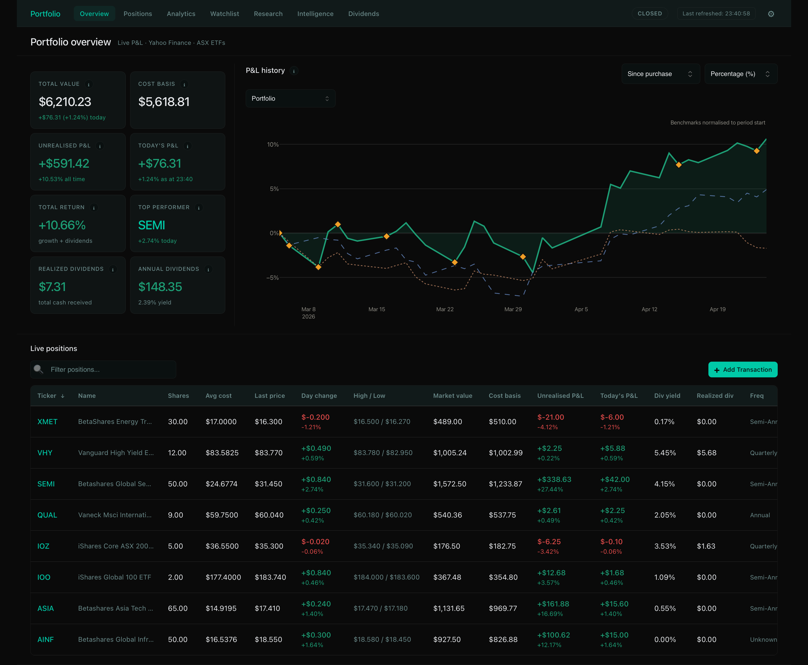

# Folio

A premium, privacy-first local investment dashboard for tracking ASX ETFs and stocks. Folio features live prices, transactional profit & loss (P&L) history, ex-dividend tracking, advanced risk analytics, and Google Gemini-powered insights.

Built with **Python**, **Dash**, **Plotly**, **yfinance**, and **Google Gemini**.



---

## 🧭 Core Philosophy & Architecture

Folio is a **private, local control center for your investments** designed for both investors who want to understand their performance and developers who want a robust, clean architecture.

### For Beginners: Why Folio?
Unlike online tracking platforms that store your private financial data on their servers, Folio runs entirely on your own computer.
*   **Privacy-First:** All transactions are stored locally. No cloud sync, no tracking, and no third-party data collection.
*   **ETF Allocation Transparency:** ETFs are like boxes of mixed chocolates holding tiny slices of hundreds of companies. Folio looks *inside* those boxes to calculate exactly how much of your total money is in technology, banking, or specific companies (e.g., Apple or BHP).
*   **Accurate Realized Dividends:** Tracks the exact date you bought your shares to calculate the dividends you actually earned (or are about to earn) based on ex-dividend rules.
*   **Built-in Research Assistant:** Powered by Google Gemini, a friendly chatbot sits on your screen to analyze holdings, explain technical charts, and fetch the latest market news.

### For Developers: High-Performance Local Design
To maintain a responsive UI (~300MB baseline memory footprint) and bypass Flask/Dash single-threaded blocking issues during heavy tasks, Folio implements a **Double-Process Architecture** orchestrated by a master launcher.

```text
┌────────────────────────────────────────────────────────┐
│                   YOUR WEB BROWSER                     │
│         (The interactive dashboard you see)            │
└──────────────────────────▲─────────────────────────────┘
                           │ (Runs locally on localhost:8050)
                           ▼
┌────────────────────────────────────────────────────────┐
│                   FOLIO LAUNCHER                       │
│    (Orchestrates the two parts below to run smoothly)   │
└──────────────┬──────────────────────────┬──────────────┘
               │                          │
               ▼                          ▼
┌─────────────────────────────┐    ┌─────────────────────────────┐
│       DASH WEB APP          │    │      BACKGROUND WORKER      │
│  • Listens to click events  │    │  • Fetches live stock prices│
│  • Renders beautiful charts │    │  • Scrapes ETF companies    │
│  • Manages page navigation  │    │  • Computes BUY/SELL signals│
└──────────────┬──────────────┘    └──────────────┬──────────────┘
               │                                  │
               └────────────────┬─────────────────┘
                                │ (Saves & Reads Data)
                                ▼
                    ┌──────────────────────────┐
                    │    LOCAL DATABASE FILE   │
                    │    (data/portfolio.db)   │
                    │   *Stays on your computer*│
                    └──────────────────────────┘
```

1.  **The Launcher ([launcher.py](launcher.py)):** Launches the Dash web app and the background worker as concurrent subprocesses, monitors their health, and intercepts OS signals to prevent orphan processes on exit.
2.  **The Dash Web App ([app.py](app.py)):** Runs the interactive UI server. Uses cached database snapshots to render pages instantly (<1s) and defers heavy network fetches to a startup interval.
3.  **The Background Worker ([worker.py](worker.py)):** A dedicated task loop running I/O-bound and CPU-heavy operations: downloading market tickers, scraping ETF metadata, calculating technical indicators, and querying the Gemini API.
4.  **The Persistence Layer ([data/portfolio.db](data/portfolio.db)):** A SQLite database configured with **Write-Ahead Logging (WAL)** mode, a `5000ms` busy timeout, and synchronous `NORMAL` writes to enable safe concurrent read/write operations between the UI and the worker.

---

## 📖 Terminology & Mathematical Specifications

Below is a combined guide explaining the financial terms used in the dashboard alongside their exact programmatic and mathematical implementations in the code.

| Financial Term | Layman Meaning (Plain English) | Technical & Mathematical Implementation |
| :--- | :--- | :--- |
| **Ticker Symbol** | A 3-to-4 letter code representing a stock or fund. E.g., `VAS` is Vanguard's Australian shares ETF. | SQLite stores tickers without suffixes (e.g. `VAS`). The market data layer maps them to `VAS.AX` dynamically when requesting data from `yfinance`. |
| **ETF (Exchange Traded Fund)** | A basket of many different company shares bundled into a single package. | Scraped via a **3-Tier Scraper Architecture** in [holdings_fetcher.py](services/market/holdings_fetcher.py): Tier 1 (Direct API), Tier 1.5 (DuckDuckGo discovery), Tier 2 (Headless WebKit via Playwright). Sector/geographic percentages are saved in `etf_metadata` with a 7-day stale check. |
| **P&L (Profit & Loss)** | The money you gained or lost on paper compared to your original purchase cost. | **Total P&L** is computed by aggregating purchase tranches. **Intraday P&L** is generated from 5-minute resampled price snapshots (`resample('5min').last().ffill()`) restricted to Sydney market hours (10:00 AM – 4:15 PM) to hide overnight trading gaps. |
| **Tranche** | A specific batch of shares bought at one time. | Stored in the `transactions` table with attributes: `price`, `units`, and `date`. If any tranche has been held for less than 365 days, the strategy engine automatically appends a short-term Capital Gains Tax (CGT) penalty warning to a `SELL` recommendation. |
| **Ex-Dividend Date** | The cutoff date for a dividend. You must own shares *before* this date to receive the payout. | The dividend engine in [dividend_service.py](services/market/dividend_service.py) performs a chronological comparison (`purchase_date < ex_dividend_date`) against individual tranches to compute exact realized cash flows. |
| **Sharpe Ratio** | A score measuring if your returns are worth the risk (price volatility) you are taking. | Calculated in [intelligence_service.py](services/intelligence_service.py) as:<br>$$\text{Sharpe} = \frac{\overline{R_p} - R_f}{\sigma_p} \times \sqrt{252}$$<br>where $\overline{R_p}$ is the mean daily log return, $\sigma_p$ is the standard deviation of daily log returns, and $R_f$ is a 4.35% annualized risk-free rate proxy. |
| **Volatility** | A measure of how wildly a stock's price bounces up and down. | Represented as the annualized standard deviation of daily log returns over a rolling historical period: $$\sigma_{\text{ann}} = \sigma_{\text{daily}} \times \sqrt{252}$$. |
| **Correlation Matrix** | A grid showing if your investments rise and fall together (helping you diversify). | Computed via pandas `.corr()` using the Pearson correlation coefficient on daily log returns over a rolling 1-year historical window. |
| **Forecasting (Prophet)** | An AI-based mathematical guess of where your portfolio's value is heading. | Uses Facebook's Prophet additive regression model ($y(t) = g(t) + s(t) + h(t) + \epsilon_t$) in [prediction_service.py](services/prediction_service.py) with custom continuity drift correction: $$\text{forecast}_{\text{corrected}} = \text{forecast} + (y_{\text{actual}} - y_{\text{fitted}})$$ at the historical boundary. |
| **RSI (Relative Strength Index)** | Momentum score (0 to 100) indicating if a stock is overbought (>70) or oversold (<30). | Vectorized pandas implementation matching Wilder's smoothing technique: Exponential Weighted Moving Average (EWMA) with a span of $2N-1$ ($com=N-1$ where $N=14$) on price gains and losses. |
| **MACD** | A trend-following momentum indicator showing the relationship between two moving averages. | Moving Average Convergence Divergence. Calculated in [technical_indicators.py](services/technical_indicators.py) returning a tuple of the MACD line ($EMA_{12} - EMA_{26}$) and the Signal line ($EMA_9(MACD)$). |
| **Bollinger Bands** | Volatility bands placed above and below a moving average. | Calculated as the 20-day Simple Moving Average (SMA) of close prices plus and minus two rolling standard deviations ($SMA_{20} \pm 2\sigma_{20}$). |

---

## ⚡ Quantitative Strategy Engine & Hysteresis

Folio features a **Deterministic Strategy Engine** ([strategy_engine.py](services/strategy_engine.py)) that scores assets on a scale of `-1.0` (Strong Sell) to `+1.0` (Strong Buy) based on five weighted dimensions:

1.  **Trend (35%):** Alignment of 20-day and 50-day Simple Moving Averages.
2.  **Momentum (20%):** Standardized RSI and MACD signal crossovers.
3.  **Value (15%):** Percentage distance of current price from the 200-day SMA.
4.  **Cost Basis (15%):** Average purchase cost relative to the current live price.
5.  **Risk/Volatility (15%):** Annualized asset volatility relative to market benchmarks.

```
       SELL               HOLD               BUY
[ -1.0 ◄─────► -0.5 ] [ -0.5 ◄─────► +0.5 ] [ +0.5 ◄─────► 1.0 ]
         │                                      │
         └───────────── Hysteresis ─────────────┘
          (Requires absolute score of >=0.7
           to flip an existing trend signal)
```

*   **Signal Boundaries:** Scores mapping to $\ge 0.5$ issue a `BUY` suggestion, while scores $\le -0.5$ issue a `SELL` suggestion. Everything else remains a `HOLD`.
*   **Hysteresis (Flip Prevention):** To prevent signal flickering on high-volatility days, an existing signal cannot flip (e.g. from `HOLD` to `BUY`) unless the new score exceeds an absolute threshold of `0.7`. When triggered, `hysteresis_forced: True` is flagged in the database.
*   **Tax Alerts:** If the user triggers a `SELL` signal on an asset, the engine checks tranche records in [portfolio.db](data/portfolio.db). If any tranche has been owned for $<365$ days, it appends a capital gains tax discount warning to the signal reasons.

---

## 🗺 Dashboard Feature Tour (Page-by-Page)

Folio features a responsive, glassmorphic sidebar menu directing users to six core layout areas:

### 1. Portfolio Holdings (Home Page)
The primary cockpit summarizing the portfolio's active metrics.
*   **Layman View:** Shows cards for Net Worth, Total Cost, Total P&L ($/%), and Today's change. Features an interactive Holdings Table listing ticker names, news sentiments, and suggestions, alongside a real-time today's P&L chart.
*   **Technical Implementation:** Hydrates from `portfolio-store` (cached Holdings JSON kept under 20KB). The Today's P&L chart fetches a 2-day history at 5-minute intervals to stitch the final hour of the previous trading day, applying Plotly `rangebreaks` to hide weekends/nights and utilizing `uirevision` to lock zoom positions on updates. The header heartbeat status dot pulses green during trading hours using `is_market_open(include_auction=False)`.

### 2. Positions Deep-Dive (`/positions`)
Detailed historical and transactional inspection of a selected asset.
*   **Layman View:** Select any ticker to view a candlestick price chart (Open, High, Low, Close) over multiple intervals, purchase transaction tranches (buying batches with date, cost, and P&L), historical/projected dividend payouts, and an AI analysis card.
*   **Technical Implementation:** Implements a dynamic layout function (`def layout():`) to prevent duplicate component ID registration. Uses the `positions-price-chart-container` to toggle visibility and hide empty states with `create_empty_fig()`. Integrates [dividend_service.py](services/market/dividend_service.py) to map historical payouts to individual tranches.

### 3. Watchlist (`/watchlist`)
Track potential investments before purchasing.
*   **Layman View:** Shows monitored assets, current prices, news sentiment, and buying recommendations. Click any item to view its historical chart, write research notes, and drag-and-drop rows using grab handles (`☰`) to reorder.
*   **Technical Implementation:** Drag-and-drop reordering uses a custom vanilla JavaScript handler ([drag_drop.js](assets/drag_drop.js)) which registers event listeners on the document body (ensuring persistence across Dash updates). The script intercepts drags starting on `.drag-handle` elements (ignoring text selections) and sends the new array to a hidden `#watchlist-order-input` component, triggering a python database update on the `order_index` SQLite table column.

### 4. Intelligence & Risk (`/intelligence`)
Mathematical inspection of portfolio risk.
*   **Layman View:** Computes volatility, Sharpe ratios, and peak-to-trough drawdowns. Includes a historical performance equity curve and an ML-powered price forecast.
*   **Technical Implementation:** Evaluates risk metrics in [intelligence_service.py](services/intelligence_service.py). Forecasts are computed via Facebook Prophet in the background, writing to `data/cache/predictions.json` to prevent main thread blocking, and rendering with an 80% confidence interval.

### 5. Deep Dive Allocation (`/analytics`)
Inspects exposure distribution across underlying fund assets.
*   **Layman View:** Displays sector treemaps, geographic maps, and a correlation matrix showing if your holdings rise and fall together.
*   **Technical Implementation:** Combines ETF holdings scraped using the 3-Tier scraper into weighted profiles. The correlation heatmap calculates returns covariance via pandas. Charts are styled using `apply_standard_layout()` to enforce consistent typography (Inter 10px), grid lines, and transparent backgrounds.

### 6. Settings Page (`/settings`)
Allows configuring settings that dynamically adjust calculation models and AI responses.
*   **Layman View:** Choose your Investment Goal (e.g. Passive Income, High Growth), Risk Profile (Conservative, Moderate, Aggressive), and Marginal Tax Bracket. Shows a preview of how weights adapt.
*   **Technical Implementation:** Saves settings in the `user_settings` table. These parameters are dynamically read by the strategy engine to adjust signal weights and by the LLM research assistant to tailor prompt suggestions.

---

## 🤖 AI Assistant & Gemini Integration

The chatbot widget in the bottom-right corner acts as a portfolio-aware assistant.

```
┌────────────────────────┐      ┌────────────────────────┐
│      USER MESSAGE      ├─────►│  RESEARCH COORDINATOR  │
│  (e.g., "Why is VAS    │      │ (research_service.py)  │
│    dropping today?")   │      └───────────┬────────────┘
└────────────────────────┘                  │ (Check keywords & trigger search)
                                            ▼
┌────────────────────────┐      ┌────────────────────────┐
│   GEMINI AI CRITIQUE   │◄─────┤   DUCKDUCKGO SEARCH    │
│    (ai_engine.py)      │      │  (ddgs financial news) │
└───────────┬────────────┘      └────────────────────────┘
            │ (Normalise verdict & apply cache)
            ▼
┌────────────────────────┐
│  PORTFOLIO-AWARE CHAT  │
│ (cites news / sources) │
└────────────────────────┘
```

1.  **AI Assistant Guardrail:** The strategy engine is the absolute source of truth for BUY/SELL/HOLD signals. The AI overlay ([ai_engine.py](services/ai_engine.py)) is limited to explaining and critiquing the engine's findings. It cannot generate signals itself.
2.  **API Cost Optimization (Cache Key Hashing):** The assistant caches AI analyses with a 24-hour TTL. To prevent price ticks from constantly busting the cache and charging API costs, the cache key is constructed using a MD5 hash of stable signals (verdict + rounded score), ignoring volatile live price fluctuations:
    ```python
    cache_key = "ai_signal_" + md5(json.dumps(stable_signals, sort_keys=True)).hexdigest()
    ```
3.  **Verdict Normalization:** The assistant normalizes all verdicts via `VERDICT_MAP` to three values: `Confident`, `Mixed`, or `Risk flagged`. Tone sanitization (`_sanitize_tone()`) strips LLM fluff before writing to the database.
4.  **Live Web Search:** When financial news keywords are matched, the research coordinator searches for recent (last month) Australian business news using the `duckduckgo-search` library with a `5s` timeout, feeding the articles into the prompt context and citing sources in the chat log.
5.  **Memory Management:** Exact chat history is logged for 7 days in `conversation_log.json`. During startup, old logs are distilled into a bulleted memory summary in `memory_summary.json` to keep contexts small. A daily message limit (20) and a storage ceiling (50MB) are enforced.

---

## 🚀 Installation & First-Time Setup

Folio manages its own environment automatically. You do not need to install complex system-wide dependencies.

### 🍏 macOS / Linux Setup
*   **Prerequisites:** macOS 12+ or Linux, Git, and an internet connection.
1.  **Open Terminal** (`Cmd + Space`, search "Terminal").
2.  **Clone this repository** and enter it:
    ```bash
    git clone https://github.com/vishalmanoj-vibe/folio.git
    cd folio
    ```
3.  **Run the Installer:**
    ```bash
    ./scripts/install.command
    ```
    *(Or double-click `scripts/install.command` in Finder).*

### 🔌 Windows Setup
*   **Prerequisites:** Windows 10/11, Git, and an internet connection.
1.  **Open PowerShell** as an Administrator.
2.  **Clone this repository** and enter it:
    ```powershell
    git clone https://github.com/vishalmanoj-vibe/folio.git
    cd folio
    ```
3.  **Run the Installer:**
    ```powershell
    scripts\install.bat
    ```
    *(Or double-click `install.bat` in the `scripts/` folder).*

### What the Installer Does Behind the Scenes:
-   Downloads **`uv`** (a high-speed Python package installer) to create an isolated environment.
-   Configures **Python 3.12** inside a local virtual environment (`.venv/`) to avoid polluting global files.
-   Installs required Python packages listed in [requirements.txt](requirements.txt).
-   Installs **Playwright WebKit** (a headless browser engine used to scrape underlying ETF holdings).
-   Prompts for a **Gemini API Key** (optional, get a free key at [aistudio.google.com](https://aistudio.google.com)) and writes it to a local `.env` configuration file.
-   Places a launch shortcut on your **Desktop**.

---

## ⚙️ Launching the Application

After installation, run the dashboard in one of three ways:

*   **Option 1: Desktop Shortcut (Recommended)**
    Double-click the **`Folio`** shortcut on your Desktop. It starts background tasks and launches `http://127.0.0.1:8050` in your browser.
*   **Option 2: Command Line**
    Navigate to the project folder and run:
    ```bash
    uv run python launcher.py
    ```
*   **Option 3: Native macOS App**
    Double-click **`Folio.app`** in the project folder (starts server processes silently; you must visit `http://127.0.0.1:8050` manually in your browser).

---

## 🛠 Troubleshooting Common Issues

*   **macOS Privilege Error:** If the installer fails to run, execute the following command in Terminal:
    ```bash
    chmod +x scripts/install.command
    ```
*   **macOS Gatekeeper Block:** If Gatekeeper warns about an *"unidentified developer"*, right-click (`Ctrl + Click`) the script, select **Open**, and click **Open Anyway**.
*   **Windows Execution Policy Block:** If PowerShell blocks downloads, open PowerShell as an Administrator and run:
    ```powershell
    Set-ExecutionPolicy RemoteSigned -Scope CurrentUser
    ```
*   **Database Locking Issues:** Sync clients (like OneDrive, iCloud, or Dropbox) can lock the database file `portfolio.db` during updates, triggering SQLite write errors. Move the project folder outside of your cloud sync directory to resolve this.
*   **Port 8050 Conflicts:** If port 8050 is in use, terminate the running process:
    -   *macOS:* `lsof -ti:8050 | xargs kill -9`
    -   *Windows (Cmd):* `for /f "tokens=5" %a in ('netstat -ano ^| findstr :8050') do taskkill /PID %a /F`
*   **Process Issues:** If you suspect background tasks are hanging, check for orphaned processes:
    ```bash
    ps aux | grep -E "app.py|worker.py"
    ```

*(For detailed solutions, see the [Troubleshooting Guide](docs/guides/TROUBLESHOOTING.md)).*

---

## 💻 Developer Reference & Directory Structure

```
folio/
│
├── launcher.py                     # Core Process Manager (starts app.py and worker.py)
├── worker.py                       # Background Task Worker (prices, scraping, AI execution)
├── app.py                          # Dash App entry point (scaffolds stores & routing)
│
├── config/                         # Configuration layer (Settings, Constants)
│   ├── settings.py                 # Settings + env vars (Refresh rates, cache TTLs, DB path)
│   ├── constants.py                # Colors, static names, themes
│   └── logging.py                  # Logging configuration
│
├── core/                           # Foundation layer
│   ├── engine/                     # Pure logic (Math, Aggregation)
│   │   ├── portfolio_engine.py     # Aggregation & Tranche history
│   │   ├── stats_engine.py         # Summary metrics & UI formatting
│   │   └── utils.py                # Math helpers
│   ├── cache.py                    # TTL cache for API responses
│   └── validators.py               # Transaction schema validation
│
├── models/                         # Domain layer
│   └── transaction.py              # Holding & Transaction schemas
│
├── services/                       # Orchestration layer
│   ├── market/                     # Network calls (yfinance)
│   │   ├── data_fetcher.py         # Enrichment logic (Bulk Fetch)
│   │   ├── dividend_service.py     # Realized Dividends & Trend logic
│   │   ├── session_cache.py        # Intraday snapshot management
│   │   └── market_status.py        # ASX timezone/status logic
│   ├── ai_engine.py                # LLM orchestration & signal critique
│   ├── strategy_engine.py          # Deterministic rule-based scoring
│   ├── alert_service.py            # Price/Target monitoring
│   ├── intelligence_service.py     # Hierarchical risk/allocation logic
│   ├── prediction_service.py       # Prophet-based forecasting
│   ├── report_service.py           # Weekly PDF generation
│   ├── research_service.py           # AI Assistant (chat & web search)
│   └── research_memory.py          # Persistent AI memory summaries
│
├── data/                           # Persistence layer
│   ├── database.py                 # SQLite connection & schema (WAL enabled)
│   ├── repository.py               # Transaction & Asset Repository
│   ├── watchlist_repository.py     # Watchlist & History Repository
│   ├── portfolio.db                # Main relational store
│   └── cache/                      # Persistent disk cache (intraday snapshots)
│
├── components/                     # UI components
│   ├── charts/                     # go.Figure factories
│   │   ├── helpers.py              # Centralized layout & empty state builders
│   │   ├── pnl_history.py          # Today view (resampled)
│   │   ├── price_history.py        # Candlestick/Line charts
│   │   └── ...
│   ├── header.py                   # Shared navigation header
│   ├── ui_helpers.py               # Stat cards & section wrappers
│   └── chatbot.py                  # Floating AI Assistant widget layout
│
├── callbacks/                      # Dash interactivity
│   ├── portfolio_callbacks.py      # Table/Metric updates
│   ├── positions_callbacks.py      # Ticker deep-dive logic
│   ├── watchlist_callbacks.py      # Watchlist logic
│   ├── signals_callbacks.py        # Manual signal generation
│   ├── intelligence_callbacks.py   # Modal & Drill-down logic
│   └── research_callbacks.py       # AI chat interaction
│
├── pages/                          # Multi-page routing
│   ├── portfolio.py                # Holdings (/)
│   ├── positions.py                # Positions (/positions)
│   ├── watchlist.py                # Watchlist (/watchlist)
│   ├── intelligence.py             # Insights (/intelligence)
│   ├── analytics.py                # Deep Dive (/analytics)
│   └── settings.py                 # Settings & Investor Profile (/settings)
│
└── assets/                         # Static assets (Modular CSS)
    ├── base-tokens.css             # Design Tokens (CSS Variables)
    ├── base-reset.css              # Global resets
    ├── ui-components.css           # Modular UI blocks (Stat cards, etc.)
    ├── view-pages.css              # Page-specific layout overrides
    └── vendor.css                  # High-specificity Radix/Dash overrides
```

### Import Paths Reference
Developers adding pages or integrating services should use standardized imports:
```python
# Importing core mathematical operations (Engine - no I/O dependencies)
from core.engine.portfolio_engine import build_holdings, compute_holding_pnl

# Importing enrichment services (Service - network and database bindings)
from services.market.data_fetcher import fetch_live, get_etf_name

# Data repository access (Data Access - database wrappers)
from data.repository import PortfolioRepository
from data.watchlist_repository import WatchlistRepository
```

### Decoupling Rules (Strict Constraints)
-   **Service Layer Purity:** Files in `services/` represent pure business logic. They must never import from Dash libraries, callbacks, layouts, or pages.
-   **Engine Layer Purity:** Files in `core/engine/` contain pure mathematical algorithms (zero network calls, zero file/database I/O, zero library bindings).
-   **CSS Variables Only:** Styling modifications must utilize the design token variables from `base-tokens.css` (e.g. `var(--bg)`, `var(--t-pri)`) rather than hardcoding hex colors, ensuring correct output in both light and dark modes.

---

## 🧪 Testing Framework

Folio maintains a mock-isolated unit testing suite built on `pytest`. All tests execute locally without making external network requests to Yahoo Finance or writing to your production database file, protecting database integrity.

```bash
# Run the complete test suite and generate HTML coverage reports
./scratch/run_tests.sh

# Open the code coverage dashboard in your browser
open htmlcov/index.html
```

The test runner handles virtual environment paths, executes lints (using `ruff` and type-checking with `mypy`), and verifies 28 mock-isolated unit testing suites (covering 197 assertions across repositories, calculation models, and Dash callbacks).

---

## 📊 Technical Stack Reference

| Layer / Component | Technology / Library |
| :--- | :--- |
| **User Interface** | Dash 2.16+, Dash Mantine Components, Dash Bootstrap Components, Plotly |
| **Database** | SQLite (WAL mode enabled, thread-safe concurrent writes) |
| **Market Data** | yfinance (bulk-optimized downloads with 290s intraday snapshot cache) |
| **Technical Indicators** | Pure Pandas calculations (Wilder's RSI, MACD, Bollinger Bands) |
| **Forecasting** | Facebook Prophet (incorporating ASX trading calendars) |
| **AI Processing** | Google Gemini 2.5 Flash / 3.1 Flash Lite (`google-genai` SDK) |
| **PDF Compilation** | ReportLab & Matplotlib |
| **Search Indexing** | DuckDuckGo Search API (`ddgs` news integration) |

---

## ⚖️ Disclaimer

Folio started as a personal tracker to solve ASX portfolio management limitations. Approximately 80% of this codebase was generated using AI tools. You should expect occasional minor bugs and are encouraged to double-check critical calculations against your broker statements.

Nothing calculated or displayed by Folio constitutes financial advice. Always consult a licensed financial advisor before making investment decisions.

---

## 📜 License

MIT License © 2026 Vishal Manoj Kumar
